# Equipment-Manager for Maya


<p align="center">
  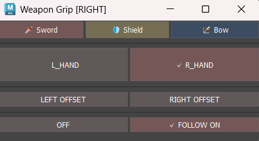
  &nbsp;&nbsp;
  
</p>

<p align="center">
  
</p>

Autodesk Maya 2026向けの、**武器の持ち替えや追従、装備状態に応じたリグ制御を管理するアニメーション支援ツール**です。

**剣・盾・弓・矢・弓弦の操作を1つのUIにまとめ、持ち替えや追従設定を手作業で切り替える際の操作負担や設定漏れを減らすことを目的としています。**

また、アニメーターからの要望をもとに、実際のアニメーション制作で必要となる操作を整理し、制作中の操作負担を減らせるよう改良を重ねました。

本ツールは、キャラクター **Diana** の武器リグ制作で使用したワークフローをもとに、各処理の役割を整理し、保守・拡張しやすい構成へ再設計しています。

---

## 共通パネル

剣・盾・弓・矢の全武器に共通するタブの機能をご紹介します。

### 武器の持ち替え

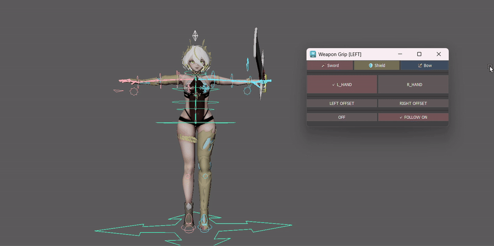

剣・盾・弓の持ち手を左右で切り替えます。

武器ごとに設定されたスペース切り替え用アトリビュートやコンストレイントを操作し、現在の持ち手を変更します。

左右それぞれにオフセットを保存でき、持ち手を切り替えた際には、対応する側の保存済みオフセットを復元します。

---

### 追従切り替え

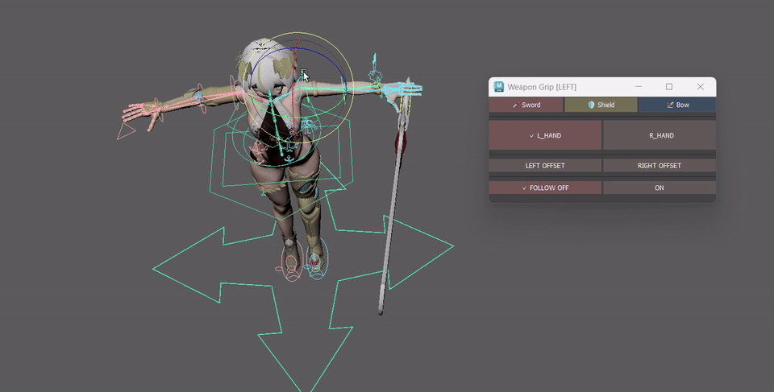

各武器のキャラクターの任意の手への追従 ON / OFFが設定できます。

武器ごとのリグ構造に合わせてコンストレイントの状態を変更し、手への追従と自由な配置を切り替えます。

現在の追従状態はMayaシーンから取得し、UIにも反映します。

フォロー中も武器のコントローラーに直接キーフレームを打つことができるため、手から離れる投げるモーション等を付けることも可能です。

---

### オフセットの保存・復元

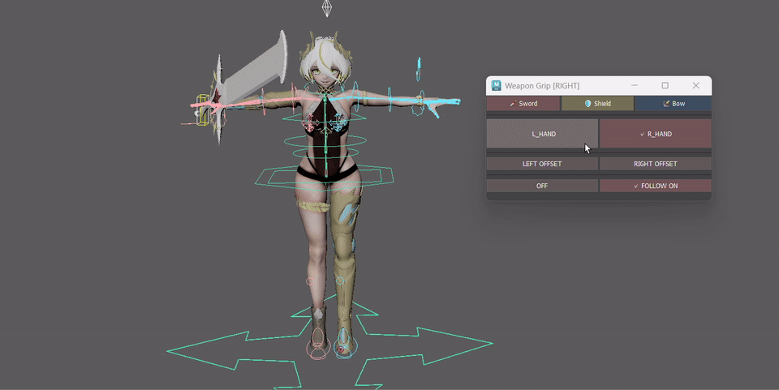

各装備について、左右それぞれの位置オフセットを任意の位置で保存できます。

保存対象はTranslate / Rotateの各チャンネルです。

持ち手を切り替えた際に対応する側のオフセットを復元することで、武器ごとに必要な位置・角度を再利用できます。

---

## 弓・矢の専用機能

弓では通常の装備操作に加えて、矢と弓弦を扱うための専用機能を実装しています。

他の武器と異なり、弓では弓と矢という複数オブジェクトの管理に加え、

* 矢と弓の位置合わせ
* 手と弦の位置合わせ
* 弦を引く
* 矢を放つ

といった工程の多い操作が必要になります。

そこで、繰り返し発生する操作をツール側で補助することで、アニメーターの操作負担を減らし、モーション表現に集中できる環境を整えることを目指しました。


---

### 矢の持ち手・追従切り替え

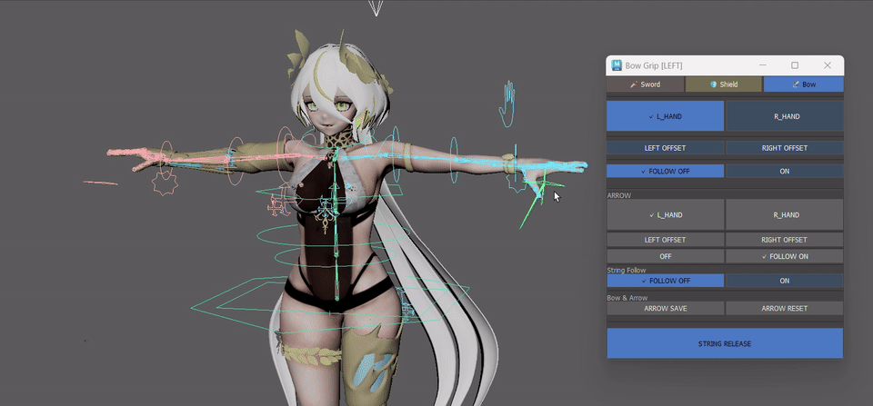

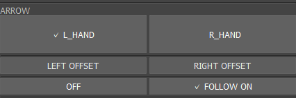

矢についても共通パネルと同様の仕組みで制御しています。


* 持ち手の切り替え
* オフセットの保存 / 復元
* 追従のON / OFF

に対応しています。


共通パネルと操作方法を統一することで、アニメーターが新しい操作を覚える負担を減らしよりどの武器でも同じ感覚で扱えるようにしました。

また、既存の装備操作と同じ仕組みを再利用することで、実装時間を短縮しながら機能追加や修正を行いやすい構成にしています。


---

### 矢の位置保存・リセット

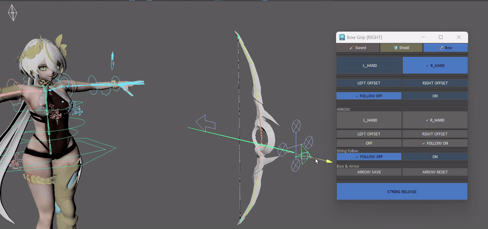

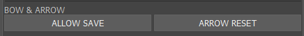


弓に矢を構える位置はアニメーション中に何度も使用するため、その都度手作業で位置・角度を合わせる負担を減らすことを目的に実装しました。

ARROW SAVEでは、弓にセットした現在の Arrow_LOC の姿勢を、String_Reset_LOC へ基準位置として保存します。

位置合わせにはローカル座標ではなくワールド座標上のTransformを使用しています。これにより、親階層や追従状態による座標系の違いに左右されにくく、弓に合わせた矢の位置・角度をそのまま保存・復元できます。

**ARROW RESET** を実行すると、保存した基準位置へ Arrow_LOC を1回だけスナップします。

---

### 弓弦操作サポート

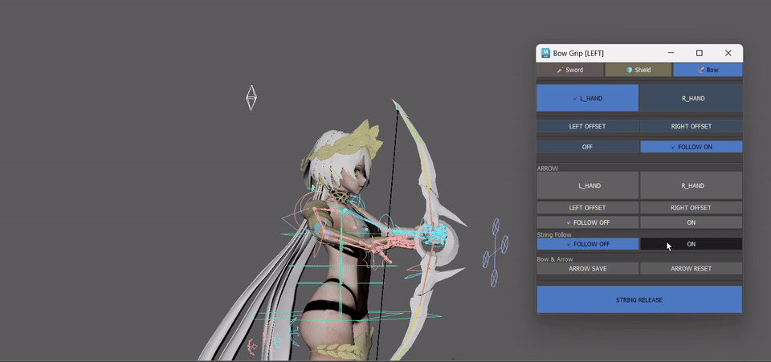


弓を引くモーションを、より直感的に作成できるようにするための機能です。

弓を持つ手とは反対側の腕を対象に、現在の姿勢を保ちながらIKへ切り替え、手のIKコントローラーと弓弦コントローラーを同時に選択します。

これにより、ボタンを押した後、そのまま弓を引く操作へ移ることができます。

```text

現在の腕の姿勢
        ↓
IKコントローラーを姿勢合わせ
        ↓
FK → IK
        ↓
手IK ＋ 弓弦を同時選択
        ↓
    弓を引く
        ↓
FKコントローラーを姿勢合わせ
        ↓
IK → FK
        ↓
通常操作へ復帰
```

当初は、手と弓弦を継続的にコンストレイントする方式も検討しました。

しかし、常に追従させる構造では弓を引いた後の細かな位置調整がしづらくなるほか、弓弦をリリースする際にコンストレイントの解除や状態管理が必要となり、処理が複雑になるという課題がありました。

そこで試行錯誤の結果、手のIKコントローラーと弓弦コントローラーを必要なときだけ同時選択する方式へ変更しました。

これにより、アニメーターが任意の位置から細かく調整できる操作自由度を保ちながら、不要なコンストレイントを増やさず、リリース処理もシンプルな構成にしています。

選択が外れた場合も、ボタンをもう一度押すことで作業を再開できます。

IK側への姿勢合わせでは、Shoulder・Elbow・Wristの位置関係からPole Vectorの位置を計算します。

弓弦操作を終了する際には、現在の姿勢にFKコントローラーを合わせてからFKへ戻すことで、切り替え時のポーズ差を抑えます。

---

### 弓弦のリリース

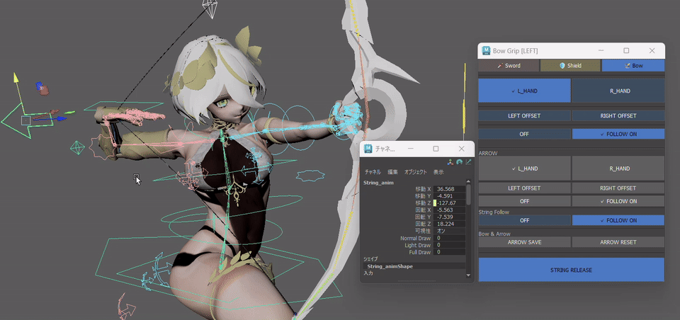


`STRING RELEASE` は、`String_anim` の弓弦操作用Attributeを初期状態へ戻す機能です。

Draw系AttributeとTranslate系Attributeを初期値へ戻し、弓弦側の状態をリセットします。

Translate系Attributeについては、外部接続されているチャンネルを変更しないように処理しています。

---

## Diana RigからEquipment-Managerへ


Equipment-Managerの原型は、オリジナルキャラクター **Diana** の武器リグ制作から生まれました。

Dianaでは剣・盾・弓・矢・弓弦など複数の装備要素があり、アニメーション制作中に持ち替えや追従切り替えを繰り返し行う必要がありました。

そこで、ConstraintやAttributeを個別に操作する代わりに、一連の操作をまとめて実行できる専用ツールを制作しました。

その後コードを整理し、

* リグ固有設定
* Mayaシーン操作
* 弓固有処理
* UIイベントと状態管理
* UI描画

を分離した現在のEquipment-Managerへ再構成しています。

現在もDiana Rigの命名規則をベースとした設定を使用していますが、リグ依存情報を `constants.py` とConfigへ集約することで、処理本体とリグ固有情報を可能な限り分離しています。

---

## 設計構成

Equipment-Managerでは、UIとMayaシーン操作を直接結び付けず、役割ごとに処理を分割しています。

```text
EquipmentManagerApp
        |
        +-- EquipmentController
        |       |
        |       +-- EquipmentService
        |       |
        |       +-- BowService
        |
        +-- EquipmentManagerUI
        |
        +-- EquipmentState

```
---

### 追従中のキーフレーム操作
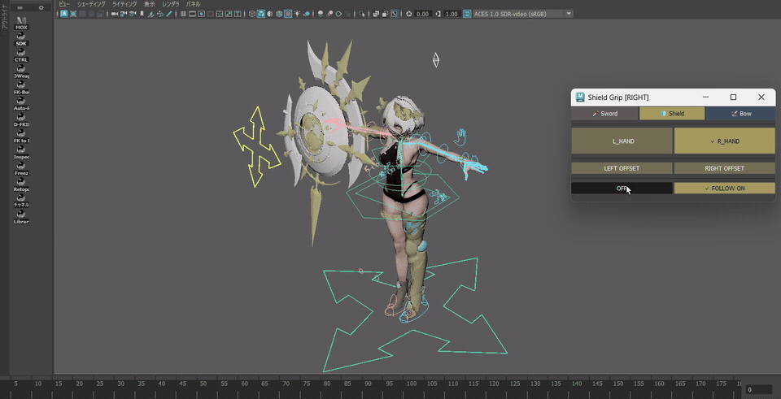


武器を手に追従させた状態でも、アニメーターが武器の位置や角度を調整できるようにしています。

当初は武器のコントローラーを直接コンストレイントする構造でしたが、アニメーターから「追従中でも武器コントローラーへ直接キーフレームを設定したい」という要望がありました。

そこで、**追従を担当するグループと、アニメーターが操作する武器コントローラーを分離**しました。

```text id="fo67qx"
手・追従ターゲット
        ↓
コンストレイント
        ↓
追従用グループ
        ↓
武器コントローラー
        ↓
武器
```

手への追従は上位の追従用グループが担当し、武器コントローラー自体のTransformはアニメーション操作用として残しています。

これにより、**手への追従を維持したまま武器コントローラーへ直接キーフレームを設定でき、追従位置を基準とした細かな位置・角度調整が可能**になりました。

Equipment-Managerでは、この構造に合わせて追従用コンストレイントの状態を切り替えることで、アニメーターが操作する武器コントローラーの自由度を保ったままFollowを管理しています。

---

## UIの視認性

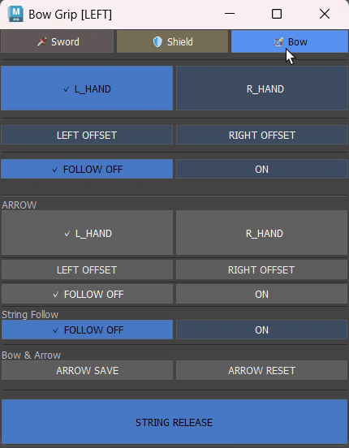

装備の状態を一目で判断できるよう、**チェック表示・ボタンの色・文字色・文字の長さを使い分け、現在の状態を視覚的に確認できるUI**を意識しています。
操作中にUIへ視線を集中させなくても、状態が切り替わったことを認識しやすい表示を目指して実際に使用しながら調整を重ねました。

また、今回のDianaリグの武器にはそれぞれ属性という設定があったため、

剣 ⇒ 太陽/炎 (赤)

盾 ⇒ 聖/光 (黄・白)

弓 ⇒ 月/氷 (青)

という各武器のイメージカラーで制作しました。
このようなこだわりを見てアニメーターが喜んで使ってくれたのが嬉しく、とても印象に残っています。

個人的には上部タブの絵文字アイコンがお気に入りです。
Unicode表記を使用し、ソースコード上での文字化けを防いでいます。

---

### 現在の状態を視覚的に表示


持ち手や追従状態など、現在選択されている項目には **✓（チェック）** を表示します。

ツール起動時や操作後にはMayaシーンから現在の状態を取得して表示を更新するため、UIを見るだけで「現在どちらの手で持っているか」「追従が有効か」を確認できます。

選択中の状態は FOLLOW ON / FOLLOW OFF、非選択側は ON / OFF と表示し、文字量そのものにも変化を付けています。

色や✓表示だけでなくボタンを押した際の視覚的な変化を大きくすることで、視線をUIへ集中させず目の端で見ていても「動いた」と認識しやすくしています。

---

### 操作に応じた色の切り替え

ON / OFFなど状態を持つ機能では、ボタンや表示色を切り替えることで、現在の状態を文字だけに頼らず判別できるようにしています。

特に、操作によって状態が変化した箇所を視覚的に認識しやすくすることで、複数の装備を扱う際の確認負担を減らしています。

---

### 操作結果のフィードバック表示
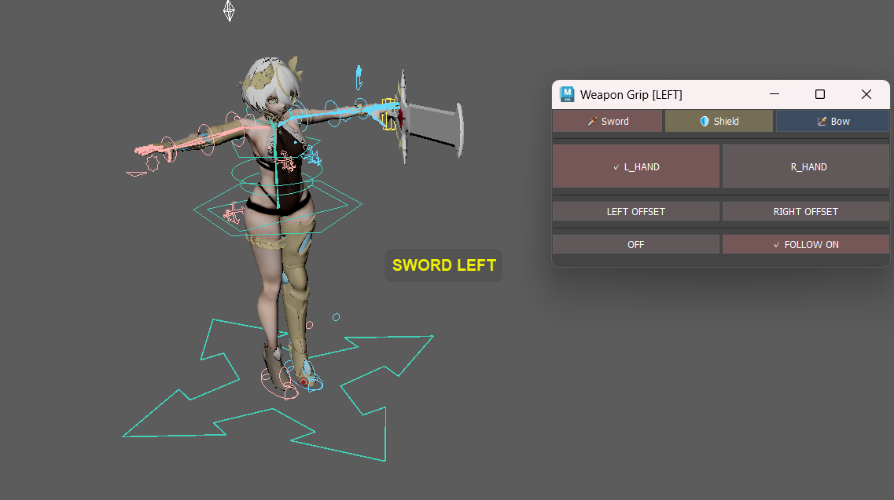

ボタン操作後には、SWORD LEFT などの操作結果を一時的に画面上へ表示します。

持ち手の切り替えなど、操作によって変更された状態をその場で確認できるようにすることで、切り替えが正しく反映されたかを視覚的に把握しやすくしています。

---
---

### 共通タブ

剣・盾・弓に共通するMayaシーン操作を担当します。

* 持ち手の切り替え
* 追従の切り替え
* Offsetの保存・復元
* 現在状態の取得

---

### 弓矢固有パネル

弓・矢・弓弦固有の処理を担当します。

* 矢の持ち手・追従切り替え
* 矢のOffset処理
* 矢の位置保存・リセット
* 弓弦のリリース
* 弓弦操作サポート
* FK / IK姿勢合わせ
* Pole Vector計算

---

### EquipmentController

UIイベントとアプリケーション状態の橋渡しを担当します。

Mayaシーンの操作はServiceへ委譲し、操作後の状態更新やUIの再描画を管理します。

---

### EquipmentManagerUI

`maya.cmds` を使用したUI描画を担当します。

シーン操作そのものは持たず、Controllerから渡された状態を表示します。

---

## シーン状態との同期

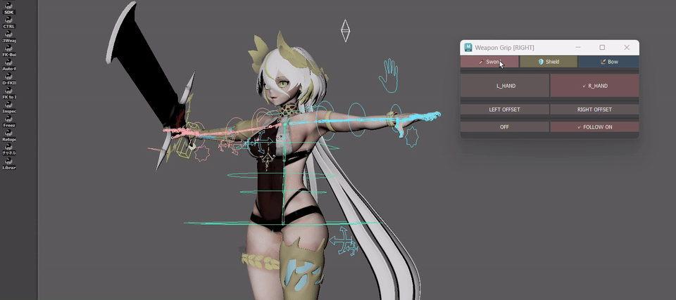

ツール起動時や装備切り替え時には、現在のMayaシーンから状態を取得します。

* 現在の持ち手
* 装備の追従状態
* 矢の追従状態
* 弓弦操作の状態

などを読み取り、UIのチェック表示やボタン状態へ反映します。

起動時の同期処理は読み取り専用として設計し、**ツールを開いただけでリグの状態が変更されないこと**を重視しています。

---

## 操作前チェック

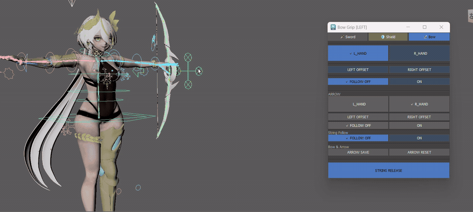

操作前に必要なNodeやAttributeを確認し、想定したリグ構造が存在しない場合には警告を表示します。

上のgifでは弓のコントローラーを一時的にデリートして検証しています。

ConstraintについてもWeight Aliasを動的に取得し、左右両方のWeightが同時に有効になっているような不正な状態を検出します。

これにより、リグ構造に問題がある状態のまま処理を続行することを防いでいます。

---

## テスト

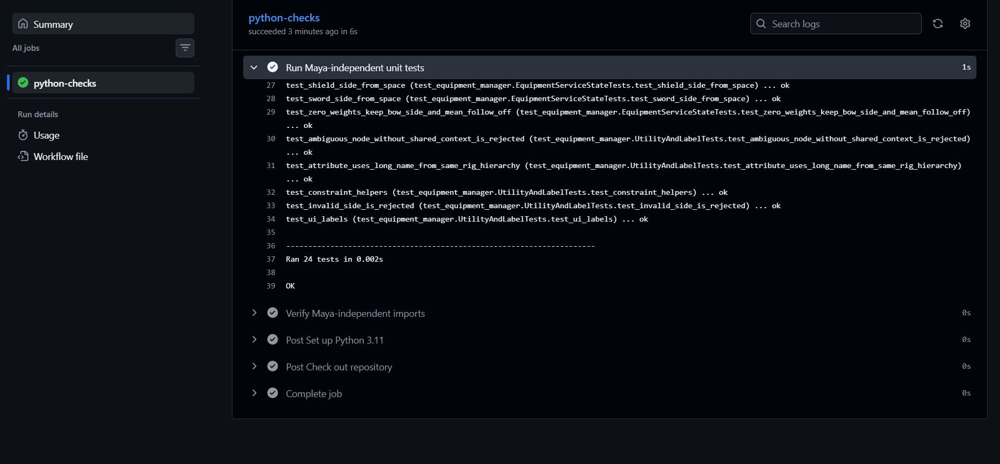

Mayaに依存しない処理については、Fake `maya.cmds` を使用したUnit Testを用意しています。

現在、**24件のUnit Test**で以下の処理を検証しています。

* Space値と持ち手判定
* Constraint Weight
* 追従状態
* Offset処理
* 矢のリセット
* FK / IK姿勢合わせ
* Pole Vector計算
* Controllerの状態遷移
* 起動時の読み取り専用同期
* UIラベル

GitHub ActionsではUnit Testに加えて、PythonファイルのCompile CheckとMaya非依存Import Checkを行っています。

---

## 動作環境

* Autodesk Maya 2026
* Python 3.11
* `maya.cmds`
* 外部Pythonパッケージ不要

---

## 現在の対応範囲

現在のバージョンは、`constants.py` に定義された命名規則に対応する単一キャラクターリグを対象としています。

複数キャラクターのNamespace自動解決や、任意のリグをUIから登録する完全な汎用システムには現在対応していません。

一方で、リグ固有の設定とツール本体の処理を分離することで、今後異なるリグへ対応しやすい構造を目指しています。

---

## プロジェクト構成

```text
equipment_manager/
  app.py
  controller.py
  services.py
  bow_service.py
  ui.py
  models.py
  constants.py
  maya_utils.py
  exceptions.py

tests/
  test_equipment_manager.py

launch_equipment_manager.py
```

---

## インストール

リポジトリをMayaユーザーディレクトリの `scripts/Equipment-Manager` へ配置します。

MayaのPython Script EditorまたはPython Shelfから起動用スクリプトを実行します。

フォルダ名を変更した場合は、起動用スクリプト内の `TOOL_DIRECTORY_NAME` も実際のフォルダ名に合わせて変更してください。

---

## ライセンス

Copyright (c) 2026 Yuzuki Midoshima
